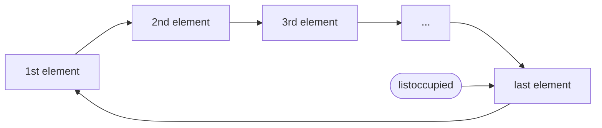

# Practice 2: Virtual memory and replacement algorithms
UAH, Departamento de Automática, ATC-SOL 
Unit 2

The goal of this practice is to study the page replacement algorithms used in virtual memory management mechanisms, clearly distinguishing the tasks performed by the hardware and the operating system in this context.

## Introduction
The objective of this practice is the study of virtual memory management mechanisms. For this purpose, the operation of an MMU (Memory Management Unit) and the corresponding part of the operating system will be simulated.

We will start by simulating the memory accesses caused by the execution of a hypothetical process which we will call ``gen_trace``. The list of memory accesses, or traces, will allow us to study the way in which the processes make use of memory, and finally will serve as input data to a virtual memory simulator. The simulator includes hardware simulation, mainly the MMU, and also software simulation, mainly of the parts of the operating system involved, and in particular, of the page replacement algorithms.

## The `gen_trace` program

The `gen_trace` program has been created to feed the simulator with a trace of realistic read/write operations. For that purpose, `gen_trace` executes a sorting algorithm on the data in an array, and outputs a log of the operations performed by the algorithm. An example of this output is shown below:

```
user@host :$ ./gen_trace MER RAN 4
T8
 R0 W4 R1 W5 R2 W6 R3 W7
 R0 R1 C W4 W5 R2 R3 C
 W6 W7 R4 R6 C W0 R7 C
 W1 W2 R5 W3 Sorted ;-)
user@host :$
```

The letter L indicates a read operation, and the letter E indicates a write operation. In both cases, the number following them indicates the array position accessed. The letter C represents a compare operation. The letter T appears only once, and indicates the total size of the array. In the example, the array size is 8 elements, and the read/write operations refer to the positions between 0 and 7. After executing the sort algorithm, `gen_trace` traverses the array to check if it has been sorted, and displays a message. The trace can be considered finished when it reaches the letter O (sorted) or the letter D (unordered).

It should be noticed that in the previous example it was necessary to access 8 elements to sort only 4. This is because the mergesort algorithm (sorting by mixing sorted lists) was used, which requires additional space.


The ``gen_trace`` program accepts three parameters:

1. The sorting algorithm: BUB, INS, SEL, HEA, COM, MER, QUI, or QPA; indicating, respectively: bubble, insertion, selection, heapsort, combsort, mergesort, quicksort, and fast with random pivot. 
2. The initial state of the array: ASC, DES or RAN; indicating respectively: ascending order, descending order and random order (or rather disorder).
3. The number of array elements to be sorted (not counting the additional space required by the mergesort algorithm).

### The lenght of the traces

The length of the traces generated by ``gen_trace`` will depend on the chosen algorithm, the initial state, and the size of the array to be sorted.

The number of operations that each algorithm needs to perform with the three different initial states, and with arrays of 10, 100 and 1000 elements, is shown below:

```
Estado inicial : ASC
===================
Tamaño	BUB	INS	SEL	HEA	COM	MER	QUI	QPA
10	19	19	99	160	46	103	108	85
100	199	199	9999	2972	2596	1860	10098	1661
1000	1999	1999	999999	43496	47383	26884	1.0e+06	23792

Estado inicial : DES
===================
Tamaño	BUB	INS	SEL	HEA	COM	MER	QUI	QPA
10	189	145	109	172	73	107	115	88
100	19899	14950	10099	3111	3149	1900	10150	1819
1000	2.0e+06	1.5 e+06	1.0e+06	44879	52480	26996	1.0e+06	26229

Estado inicial : RAN
===================
Tamaño	BUB	INS	SEL	HEA	COM	MER	QUI	QPA
10	133	84	117	165	79	109	71	78
100	14950	7763	10197	2998	3376	2080	1761	1675
1000	1.5e+06	741726	1.0e+06	42956	59179	30674	26701	34214
 
```

Note that there are very marked differences, both between algorithms and between different initial states for the same algorithm. The selection algorithm (SEL), for example, is particularly slow in all cases, while the heapsort algorithm (HEA) is reasonably fast in all cases. On the other hand, the quicksort algorithm (QUI) is the fastest when the data are initially in random order, but is very slow when they are initially already sorted. This is because the implementation of quicksort in `gen_trace` always chooses the first element as the pivot. The quicksort algorithm with random pivot (QPA) is very fast in these experiments, but if the sequence of random numbers it uses to choose the pivot is known, it can generate an initial state that makes it behave just as badly as the normal quicksort.

For more information on sorting algorithms, please consult the literature. 

## Working sets

The working set of a program section is the group of memory pages it references. Throughout the execution of a process, there are periods when it focuses on a small working set, reusing a few pages for a long time, and there are other periods when it rapidly references many different pages.

The smaller the working set, the more likely it is that the referenced pages will be present in physical memory frames. 

On the other hand, the larger the working set, the more likely it is that some pages will be evicted from their frames to make room for others, which will then lead to page faults when referencing them again.

Figure bellow shows a graph generated from a run of ``gen_trace`` with the mergesort algorithm. It depics the working set evolution over the iterations of the algorithm, which correlates with the time. The initial spike is due to the fact that this implementation of mergesort starts by copying the entire array to be sorted into the temporary array. Next, the working set is considerably reduced by the order in which ordered lists are built from smaller ordered lists: first an ordered pair is formed with elements 0 and 1, then another ordered pair is formed with elements 2 and 3, and then those two pairs are merged into a 4-element list. Then another list of 4 elements is formed following the same procedure, and mixed with the previous one, to generate the first list of 8 elements, and so on.


As the sorted lists get larger, more different memory locations are accessed more quickly, increasing the working set. The last mix of sorted lists accesses all the array locations in a short time, making the working set as large as at the initial peak.

The following table shows the working sets of the different sorting algorithms:

- Select algorithm: 

- Insert algorithm:

- Quicksort algorithm

- Mergesort algorithm

- Combsort algorithm

- Quicksor algorithm with random pivot

- Bubble algorithm

- Heapsort algorithm


Generally speaking, we can distinguish three profiles:
1.	Algorithms that use fewer pages at the beginning and grow as the array is sorted. In this case we would find the insertion algorithm (INS).
2.	Algorithms that use more pages at the beginning and decrease as the array is sorted. In this case there are the selection algorithms (SEL), the two quicksort algorithms (QUI, QPA), heapsort (HEA), the bubble algorithm (BUB) and the combsort.
3.	The algorithms that present peaks of use at the beginning, in the middle and at the end of the sorting. In this case we would find the mergesort algorithm.

## The virtual memory simulator

The rest of this practice will consist of completing, and then modifying, a program that simulates the operation of an MMU (Memory Management Unit) and the part of the Operating System that manages the virtual memory. 

The simulator is almost completely programmed, and only some functions need to be added to be able to run it.

The `main` function of the simulator executes ``gen_trace`` and interprets its standard output. For each read/write operation, it invokes the `sim_mmu` function, which simulates access to the specified virtual address.

Open the file `sim_paging.h` and read carefully the declaration of the `spage` structure type. 

```c
typedef struct
{
    char present;       // 1 = loaded in a frame
    int frame;          // Frame where it is loaded
    char modified;      // 1 = must be written back to disc
                            // if moved out of the frame
    // For FIFO 2nd chance
    char referenced;    // 1 = page referenced recently

    // For LRU(t)
    unsigned timestamp; // Time mark of last reference

    // NOTE: The previous two fiels are in this structure
    //       ---and not in sframe--- because they simulate
    //       a mechanism that, in real life, would be
    //       supported by the hardware.
} spage;
```


This structure is the structure of each entry in the page table, i.e. the page table is simulated by an array of `spage` structures. The `present` field indicates whether the page is loaded in physical memory (occupying a frame). If this field is 0, all other fields are considered invalid. If it is 1, then the frame field stores the number of the physical frame in which the page is loaded, and the `modified` field indicates whether the page has been written to since it was loaded, or whether it has only been read. The `referenced` and `timestamp` fields will serve to simulate systems with FIFO (First In → First Out) replacement with 2nd chance and LRU (Least Recently Used) respectively.

The `present`, `modified` and `referenced` fields are stored occupying one byte each to make the simulator code more readable. In a more realistic simulation, they should be packed so that they occupy only one bit each.

The page table must be known and manipulated by both the hardware and the operating system. In the simulator, the `sim_mmu` and `page_reference` functions (implemented in (`sim_pag_random.c`) are the ones that do the hardware work, while all the others simulate the behavior of the operating system.

Take a look at the `page_reference` function. Like all the functions we will discuss here, it receives a pointer S that points to a structure that stores the state of the simulated system. Among other things, that structure contains a pointer to the page table, and some memory reference counters. In addition, the function receives the number of the page being accessed, and the type of operation (R/W). The `page_reference` function increments the read or write counter (depending on the type of operation) and also, if the operation is a write operation, it accesses the page table to activate the modified bit of the entry corresponding to the page in question.

Complete `sim_mmu` by following the instructions below.
```c
unsigned sim_mmu(ssystem* S, unsigned virtual_addr, char op) {
  unsigned physical_addr;
  int page, frame, offset;

  // TODO(student):
  //       Type in the code that simulates the MMU's (hardware)
  //       behaviour in response to a memory access operation

  return physical_addr;
}
```

First, `sim_mmu` must calculate the page number and offset from the virtual address. The page size is stored in the `pagsz` field of the structure pointed to by S. In the simulation, each memory location contains one element of the array to be sorted. The page size is specified in number of elements. The number of bits or bytes an element occupies is irrelevant in this practice.

```c
page   = virtual_addr / S-> pagsz ;	// Quotient 
offset = virtual_addr % S-> pagsz ;	// Reminder
```

Then `sim_mmu` must check that access to the specified address is legal:

```c
if ( page <0 || page >= S->numpags )
{
	S- > numillegalrefs++;  // References out of range 
	retum ~0U;	// Return invalid physical 0xFFF..F
}
```

Once the address has been calculated and found to be legal, the page table must be consulted to see if the page in question is loaded into physical memory. If it is not, you must trigger a page fault trap, i.e. interrupt the process and invoke the operating system to resolve the problem. In the simulator, the function `handle_page_fault` will play the role of that operating system routine, taking care of loading the page in some memory frame.

```c
if (! S->pgt[page].present )
	// Not present: trigger page fault exception 
	handle_page_fault(S, virtual_addr);
```

Once the operating system has loaded the page into a frame and modified the page table accordingly, the memory access operation is resumed.

The next step is to translate the virtual address into a physical address.

```c
// Now it is present
frame = S->pgt[page].frame ;	
physical_address = frame*S->pagsz+offset;
```

Again, if the page size were a power of 2, multiplication and addition would simply reduce to the operation of concatenating two binary numbers.

The page must also be marked as referenced:
```c
reference_page (S, page, op);
```

All that is left is to display the memory access information on the screen if the user has ordered to run the simulator in D (detailed) mode:
```c
if (S->detailed) {
	printf ("\t %c %u==P %d(M %d)+ %d\n", op, dir_virtual, pagina, marco, desplazamiento);
}
```

Next, we will study the role of the operating system in virtual memory management. In this regard, during process execution, the entry point to the operating system is the page fault handling routine. But before tackling it, we will look at other data structures that the operating system needs to manage.

If you only had the page table, the operating system would have to do expensive sequential lookups through the entire table to perform the following operations:

-  Determine whether a frame is free or occupied.
-  Finding out which page is stored in a given frame.
-  Finding a free frame (assuming there is one).
-  Choose a frame to replace the page that occupies it (in case there is no free frame).

The operating system solves this problem by maintaining a frame table. The MMU does not need to know about the existence of the frame table because it is maintained exclusively by the operating system.

Note the declaration of the `sframe` structure type in `sim_page.h`. The `page` field indicates the number of the page that is stored in the frame. The `next` field is used to keep the free frames organized in a linked list. It stores the number of the next frame in the list. 

The linked list of free frames is circular. The `freelist` field of the `ssystem` type structure (to which S points) stores the number of the last frame in the list. To get to the first in the list you only need to check the `next` field of the last one, because the list is circular. The function `init_tables` takes care that, at first, the list of free frames contains all the frames. When the list is empty, `S->listfree` will be -1.

Complete the function `handle_page_fault` by following the instructions below. First, calculate the page number that caused the failure. Also, increment the page fault counter and display a message on the screen if the simulator is in D (detailed) mode.

```c
S->numpagefaults ++;
page = virtual_address / S-> pagesz;
if (S->detailed) {
	printf ("@ PAGE_FAULT in P %d!\n", page);
}
```

In case there are free frames, it will be enough to take one from the list (the first one is the closest) and fill it with the requested page:
```c
if (S->listfree != -1) {
	// There are free frames
	last = S->freelist;
	frame = S->frt[last].next;
	if (frame==last) {
		// Then, this is the last one left.
		S->freelist = -1;
	} else {
		// Otherwise, bypass
		S->frt[last].next = S->frt[frame].next;			
	}
	occupy_free_frame(S, frame, page);
}
```
If there are no free frames, one of the occupied frames must be chosen and evicted so that the requested page can be loaded into it. The replacement policy (the algorithm that chooses the victim page) and the replacement operation itself are implemented separately.

```c
if (S->listfree != -1) {
	// There are free frames
	// ...
} else {
	// There are not free frames
	victim = choose_page_to_be_replaced(S);
	replace_page(S, victim, page);
}
```

Notice the code of the `replace_page` function. It should be noted that, in a real operating system, this routine not only takes care of updating the tables and loading the new page into the frame, but also has to dump the victim page to disk in case it has been modified while it was loaded.

Complete the function `occupy_free_frame`. You only have to make the page-frame link, and mark the page bits appropriately. In a real system, this function would also read the page from disk to put it into the frame.

### Random replacement

Edit the `Makefile` and add to the target `all` the program `sim_pag_random`. Compile and run the simulator:

```bash!
$ make
$ ./sim_pag_random 1 3 HEA DES 4 D
```

The above command specifies a single-element page size, a physical memory size of three pages, mode D (detailed), and execution of ``gen_trace`` with `HEA` `DES` `4` parameters (heapsort algorithm, initial state of descending order, and array to be sorted of four elements). In the current lab setup, the resulting report should match the following:

```
---------- INFORME GENERAL ----------
Referencias de lectura:	20
Referencias de escritura:	17
Fallos de página:	7
Páginas volcadas a disco :	2
---------- TABLA DE PÁGINAS ---------

PÁGINA	Presente	Marco	Modificada
0	1	1	1
1	1	0	1
2	1	2	1
3	0	-	-
---------- TABLA DE MARCOS----------

MARCO	Página	Presente	Modificada
0	1	1	1
1	0	1	1
2	2	1	1
--------- INFORME REEMPLAZO ---------
Reemplazo aleatorio (no hay info. específica)
-------------------------------------
FALLOS DE PÁGINA : ---»» 7 ««--- 
```

### LRU replacement policy

Next, we will make a version of the simulator with another replacement policy. Make a copy of the file `sim_pag_random.c` and call the new `sim_pag_lru.c`. Edit the Makefile and add to the target `all` the program `sim_pag_lru`. Modify the comment in the header of `sim_pag_lru.c` to match the file name.

The LRU (Least Recently Used) replacement policy consists of choosing the least recently used page as the replacement victim in the hope that it will not be referenced in the near future either. Implement this policy with the following modifications:

1. Add instructions to the `reference_page` function to store the value of the clock in the timestamp field of the accessed page, and then increment the value of the clock. Also add a check to print a warning message in case the clock overflows and returns to a value of 0.
2.	In `choose_page_to_be_replaced`, implement a sequential search for the occupied frame whose page has the lowest timestamp. Change "random" to "LRU" in the `printf` message. Delete the random function.
3.	In `print_page_table`, add a column showing the clock-timestamp value of the pages present in memory.
4.	In `print_replacement_report` display the clock value and the minimum and maximum timestamp of the pages present in memory.

Compile and run the new `sim_pag_lru` program. Verify that the results make sense. You can use the page fault numbers from the LRU column in the next table as a reference.

```
Parámeters		Random	LRU	FIFO	FIFO2a	Optimal
16 3 HEA DES 1OO	28O	282	283	285	171
16 8 HEA DES 1OOO	31O1	2436	2877	2642	136O
16 32 HEA DES 1OOOO	15614	1O8O2	13427	11211	8792
16 3 MER DES 1OO	158	1O4	119	118	83
16 8 MER DES 1OOO	1111	9O5	9O7	898	722
16 32 MER DES 1OOOO	1O19O	9549	9458	953O	8146
```

### FIFO replacement policy

Make a new copy of `sim_pag_random.c` and name it `sim_pag_fifo.c`. Repeat the initial steps in the previous section, this time to create the `sim_pag_fifo` program.

Implement the FIFO replacement policy. This policy consists of evicting the pages in the same order in which they were loaded. That is, the page that goes in first, comes out first (First In → First Out). To do this, maintain a linked circular list of occupied frames as shown in the next figure. The `listoccupied` field of the `ssystem` structure will point to the last element. 



Compile the program and run it in mode D (detailed) with a reduced number of pages and frames to verify that the replacement is done in FIFO order. Then run it with the parameters of one of the examples in the previous reference table to verify that the number of page faults matches.

### FIFO replacement with second chance

Make a new copy from `sim_pag_fifo.c` and name it `sim_pag_fifo2ch.c`. Repeat the initial steps in the previous sections, this time to create the program `sim_pag_fifo2ch.c`.

Modify `sim_pag_fifo2ch.c` so that it implements the 2nd chance FIFO replacement policy. This policy consists of giving a second chance to the first frame in the FIFO queue, but only if the page has been referenced since the last time the frame was first in the queue. The second chance consists of skiping the referenced page of that frame, moving the frame to the bottom of the occupied list, but setting the page reference bit to zero.

Make the following changes:

1. In `reference_page`, set the page reference bit to 1.
2. In , program a loop that skips the referenced page frames (setting its reference bit to 0 and making `S->busy_list` also advance) until it finds a frame whose page has the reference bit set to 0 (that will be the candidate of the replacement). 
3. In `print_page_table` and `print_table_frame`, Add a column showing the reference bit of the pages.
4. Modify also `print_replacement_report` to show the reference bit of the page stored in each frame.

Compile the program and run it in mode D (detailed) with a reduced number of pages and frames to verify that the replacement is done in FIFO order with 2nd chance. Then run it with the parameters of one of the examples in Table 1 to verify that the number of page faults matches.

### Optimal replacement

The best possible replacement policy would be to replace, in each case, the page that would take the longest time to be referenced. To do this, the operating system would need to predict the future efficiently and accurately.

> The most efficient way to accurately predict the future is to wait until it happens. For now. In the future we will see...

Obviously, optimal replacement is not feasible in a real system. However, it is interesting to be able to simulate it because its behavior is the ideal model that a good replacement algorithm should approach.
The program `sim_pag_optimum` simulates the optimal replacement by “cheating”, i.e. by saving the whole trace in memory before starting the simulation so that it knows at each step what is going to happen next and decides accordingly.
Run `sim_pag_optimum` in D (detailed) mode with a reduced number of pages and frames, and observe the result. For example:

```
user©host: $ ./ sim_pag_optimo 1 1 BUB RAN 2 D | grep ©
© ¡FALLO DE PÁGINA en P0!
© Alojando P0 en M0
© ¡FALLO DE PÁGINA en P1!
© Eligiendo P0 (tardará 1 operaciones en ser utilizada de nuevo) de M0
para reemplazarla
© Reemplazando víctima P0 por P1 en M0
© ¡FALLO DE PÁGINA en P0!
© Eligiendo P1 (tardará 1 operaciones en ser utilizada de nuevo) de M0
para reemplazarla
© Reemplazando víctima P1 por P0 en M0
© ¡FALLO DE PÁGINA en P1!
© Eligiendo P0 (no se usará más) de M0 para reemplazarla
© Volcando P0 modificada a disco para reemplazarla
© Reemplazando víctima P0 por P1 en M0
```
